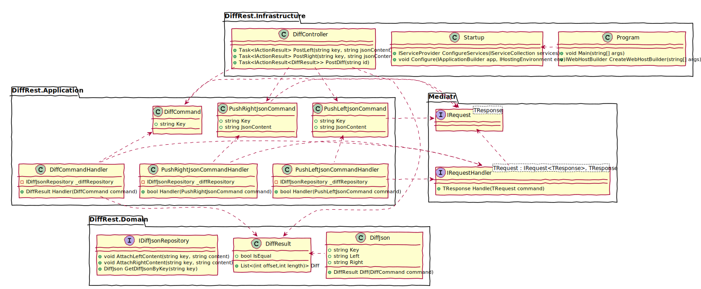

# Json Differ Project

## Archtecture overview

First of all I've "scratched" a package design solution to deliver the described assignment. Drawing is a good way to communicate my intent and clear some design assumptions. I would probably use a piece of paper or a whiteboard, but for later review I've put some extra effort to do it on a Plantuml. 

The architecture/design has MVC, CQS, DDD and event driven patterns. Also, used TDD, BDD, code clean practices.

On the VCS I've implemented a CI pipeline that builds the solution, run the unit and integration and code analyses, then, if every thing passes, it pushes a container to the staging environment.

## To-do-List

### Product managment and release

- [x] Problem analysis
- [x] Archtecture concept
- [x] Archtecture overview
- [x] CI pipeline
- [x] [Backlog(Userstories)](docs/Backlog.md)
- [ ] Writte down Bdd Scenarios
  - [ ] Post JSON doc for Diff
    - [x] Post valid json sides for right and left side
    - [x] Post invalid json for right and left side
    - [ ] Post duplicated json for right and left side
  - [ ] Post request for JSON diff
    - [x] Rest result for equal jsons
    - [x] Rest result for different sizes jsons
    - [x] Rest result for equal sizes and different jsons
    - [ ] Inform if the key wasn't posted 
    - [ ] Inform if any side wasn't filled 

### Technical Tasks

- [x] Project setup
- [ ] Remove fix messages from code
- [ ] Setup a database for persistence 
- [ ] Find better response message format for identifying diff with different sizes
- [ ] Create scripts to easyly do exploratory test(swagger-codegen)

## Pipeline metrics

### Master

### Develop

### SonarCloud

   
