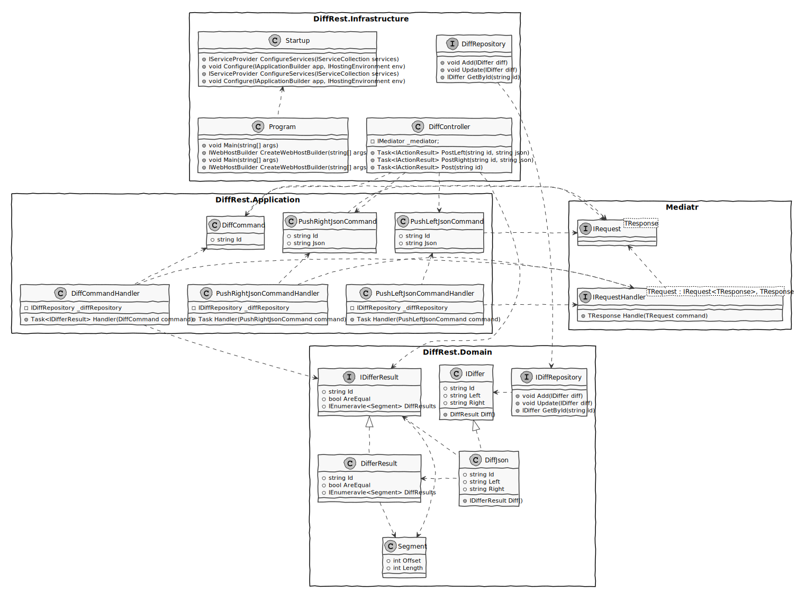

# Json Differ Project

## Archtecture overview

First of all I've "scratched" a package design solution to deliver the described assignment. Drawing is a good way to communicate my intent and clear some design assumptions. I would probably use a piece of paper or a whiteboard, but for later review I've put some extra effort to do it on a Plantuml. 

The architecture/design has MVC, CQS, DDD and event driven patterns. Also, used TDD, BDD, code clean practices.

On the VCS I've implemented a CI pipeline that builds the solution, run the unit and integration and code analyses, then, if every thing passes, it pushes a container to the staging environment.

## To-do-List

### Product managment and release

- [x] Problem analysis
- [x] Archtecture concept
- [x] Archtecture overview
- [ ] CI pipeline
- [ ] Backlog Userstories

### Project development

- [ ] Project setup